<div align="center">
  
  
  
  ### *No One Can Solve It Alone*
  
  [](https://reactjs.org/)
  [](https://www.typescriptlang.org/)
  [](https://vitejs.dev/)
  [](https://tailwindcss.com/)
  
  **A cooperative puzzle game where strangers from different backgrounds must unite to solve challenges neither can complete alone.**
  
  [🎮 Play Now](#getting-started) • [📖 How It Works](#how-it-works) • [🚀 Features](#features) • [🛠️ Tech Stack](#tech-stack)
  
  ---
</div>

## 🎯 What is BridgeQuest?

BridgeQuest is an innovative **cooperative puzzle game** that pairs you with a stranger from another country. Each player sees **only half** of the puzzle clues on their screen—you must **communicate and collaborate** to find the solution. It's not just about solving puzzles; it's about building connections across cultures.

### 🎬 Experience Flow

```mermaid
graph LR
    A[🎨 Splash Screen] --> B[🏠 Landing Page]
    B --> C[🔍 Matchmaking]
    C --> D[🎮 Level 1: Cultural]
    D --> E[🕸️ Level 2: Graph Theory]
    E --> F[🌍 Level 3: Similarity]
    F --> G[🧮 Level 4: Logic]
    G --> H[🏆 Unity Report]
    H --> B
```



---

## ✨ Features

### 🔐 Split Information Mechanic
- **You see half** the puzzle clues
- **Partner sees the other half**
- **Neither can solve it alone** ← This is the magic!

### 🌍 Cross-Cultural Missions
- Match with players from **different countries**
- Solve **language translation** challenges
- Discover **cultural similarities** between nations
- Learn phrases in **Japanese, Spanish, Tamil, French, Norwegian**

### 🧠 AI-Powered Puzzles
- **Gemini 2.5 Flash** generates unique puzzles every time
- **Wolfram Alpha API** provides real mathematical and cultural data
- Three puzzle types:
  - 🌐 **Cultural**: Country facts, languages, traditions
  - 🕸️ **Graph Theory**: Node paths, shortest routes
  - 🧮 **Logic**: Sequences, patterns, mathematics

### 📊 Real Unity Score
Calculates your teamwork based on:
- 💬 **Communication** - Message frequency and balance
- 🤝 **Collaboration** - How well you work together
- ❤️ **Empathy** - Supportive language detection
- ⚡ **Performance** - Time and accuracy

### 🎭 Smart AI Partner
- **Country-specific personalities** (e.g., polite Japanese, warm Spanish)
- **Strategic hint-giving** (shares clues gradually)
- **Natural conversation flow**

### 🎚️ Dynamic Difficulty
Adapts based on your performance:
- Low errors + fast completion = **harder puzzles**
- Struggling? = **easier challenges**

---

## 🎮 How It Works

<details>
<summary><b>📖 Click to see the game flow</b></summary>

### 1. **Splash Screen** (8 seconds)
Beautiful animated loading with 4 phases:
- 🧠 Initializing Wolfram Engine
- 🌍 Connecting Global Network
- 👥 Preparing Cooperative Protocols
- ⚡ Generating Puzzle Matrix

### 2. **Landing Page**
- Choose "Start Adventure" to begin tutorial
- Or click "How to Play" for instructions

### 3. **Interactive Tour** (Optional)
5-step guided tutorial explaining:
- What BridgeQuest is
- Split information mechanic
- How to chat effectively
- Types of puzzles
- Unity Score system

### 4. **Matchmaking**
Scan animation pairs you with a partner from another country

### 5. **Gameplay** (4 Levels)
Each level has a theme:
- 🌲 Forest of Miscommunication
- 🌉 Bridge of Differences
- 🕳️ Cave of Empathy
- ⛰️ Mountain of Unity

### 6. **Unity Report**
See your final scores with beautiful radar charts!

</details>

---

## 🚀 Getting Started

### Prerequisites
- **Node.js** (v18 or higher)
- **npm** or **yarn**

### Installation

```bash
# Clone the repository
git clone https://github.com/ABHIJATSARARI/popy.git
cd popy

# Install dependencies
npm install
```

### Environment Setup

Create a `.env.local` file in the root directory:

```env
GEMINI_API_KEY=your_gemini_api_key_here
WOLFRAM_APP_ID=your_wolfram_app_id_here
```

<details>
<summary><b>🔑 How to get API keys</b></summary>

#### Gemini API Key
1. Go to [Google AI Studio](https://ai.google.dev/)
2. Sign in with your Google account
3. Click "Get API Key"
4. Copy your key

#### Wolfram Alpha API Key
1. Go to [Wolfram Alpha Developer Portal](https://developer.wolframalpha.com/)
2. Sign up for a free account
3. Create a new app
4. Copy your App ID

</details>

### Run Development Server

```bash
npm run dev
```

Open [http://localhost:3000](http://localhost:3000) in your browser.

### Build for Production

```bash
npm run build
npm run preview
```

---

## 🛠️ Tech Stack

<table>
<tr>
<td valign="top" width="33%">

### Frontend
- **React 19.2.0** - UI Framework
- **TypeScript 5.8.2** - Type Safety
- **Vite 6.2.0** - Build Tool
- **Tailwind CSS** - Styling
- **Lucide React** - Icons
- **Recharts 3.4.1** - Charts

</td>
<td valign="top" width="33%">

### AI & APIs
- **Google Gemini 2.5 Flash** - Puzzle Generation
- **Wolfram Alpha API** - Real Data
- **Vite Proxy** - CORS Handling
- **REST APIs** - External Integration

</td>
<td valign="top" width="33%">

### Development
- **Node.js** - Runtime
- **ESM Modules** - Module System
- **Git** - Version Control
- **AI Studio** - Deployment

</td>
</tr>
</table>

---

## 📂 Project Structure

```
popy/
├── 📄 App.tsx                 # Main app component
├── 📄 index.tsx              # Entry point
├── 📄 types.ts               # TypeScript interfaces
├── 📄 constants.ts           # Game constants
├── 📁 components/
│   ├── SplashScreen.tsx      # 8s loading animation
│   ├── LandingPage.tsx       # Hero & features
│   ├── TourGuide.tsx         # Interactive tutorial
│   ├── Lobby.tsx             # Matchmaking screen
│   ├── GameRoom.tsx          # Main gameplay
│   ├── PostGameReport.tsx    # Results & charts
│   ├── WolframTerminal.tsx   # Code aesthetic
│   ├── Button.tsx            # Reusable button
│   └── HelpTooltip.tsx       # Contextual help
├── 📁 services/
│   ├── geminiService.ts      # AI puzzle generation
│   └── wolframService.ts     # Wolfram API calls
├── 📄 vite.config.ts         # Vite configuration
├── 📄 package.json           # Dependencies
└── 📄 README.md              # You are here!
```

---

## 🎨 Key Features Breakdown

### Split Information Mechanic
```typescript
interface PuzzleData {
  playerClues: string[];    // What YOU see
  partnerClues: string[];   // What PARTNER sees (hidden from you)
  solution: string;         // The answer requires both!
}
```

### Real Unity Score Algorithm
```typescript
Collaboration = min(100, messageCount × 5) - skips×10
Communication = min(100, messageBalance × 100) - skips×10
Empathy = min(100, 80 + supportiveWords×5 - errors×2)
```

### Adaptive Difficulty
```typescript
if (errors < 2 && avgTime < 60s) {
  difficulty = level + 1  // Make it harder
} else if (errors > 5) {
  difficulty = level - 1  // Make it easier
}
```

---

## 🎯 Game Mechanics

### Puzzle Types

<details>
<summary><b>🌐 Cultural Puzzles</b></summary>

Example: **Language Bridge**
- Player sees: `こんにちは` (Japanese characters)
- Partner sees: "Means 'Hello', pronounced 'Konnichiwa'"
- Solution: `Hello`

</details>

<details>
<summary><b>🕸️ Graph Theory Puzzles</b></summary>

Example: **Shortest Path**
- Player sees: Node connections `A→B, A→C, B→D`
- Partner sees: Path weights `C→E (cost:2), D→E (cost:5)`
- Solution: `A-C-E` (shortest path)

</details>

<details>
<summary><b>🧮 Logic Puzzles</b></summary>

Example: **Fibonacci Sequence**
- Player sees: `1, 1, 2, 3, 5, 8, 13... F(10) = 55`
- Partner sees: `F(11) = 89, Formula: F(n) = F(n-1) + F(n-2)`
- Solution: `144` (F(12))

</details>

---

## 🌟 Screenshots

### Landing Page


### Split Information View


### Unity Report


---

## 🎓 What I Learned

Building BridgeQuest taught me:
- ✅ **Real-time AI integration** with Gemini API
- ✅ **External API handling** with CORS proxies
- ✅ **Complex state management** with React Hooks
- ✅ **Performance tracking algorithms** for adaptive gameplay
- ✅ **Cross-cultural data structuring** with 5 countries
- ✅ **Graph theory visualization** in web apps
- ✅ **Responsive design patterns** for mobile/desktop
- ✅ **TypeScript best practices** for type safety

---

## 🤝 Contributing

While this is primarily a hackathon project, suggestions are welcome!

1. Fork the repository
2. Create your feature branch (`git checkout -b feature/AmazingFeature`)
3. Commit your changes (`git commit -m 'Add some AmazingFeature'`)
4. Push to the branch (`git push origin feature/AmazingFeature`)
5. Open a Pull Request

---

## 📜 License

This project is built for educational purposes and hackathon submission.

---

## 🙏 Acknowledgments

- **Wolfram Alpha** - For providing real mathematical and cultural data
- **Google Gemini** - For AI-powered puzzle generation
- **AI Studio** - For hosting and deployment platform
- **Lucide Icons** - For beautiful icon library
- **Recharts** - For data visualization

---

## 📞 Connect

Built with 💜 by [Abhijat Sarari](https://github.com/ABHIJATSARARI)

**Project Link:** [https://github.com/ABHIJATSARARI/BridgeQuest](https://github.com/ABHIJATSARARI/BridgeQuest)

---

<div align="center">
  
  ### 🌉 *Build Bridges, Not Walls*
  
  **BridgeQuest** - Where strangers become allies through cooperation
  
  ⭐ Star this repo if you believe in the power of unity! ⭐
  
</div>
